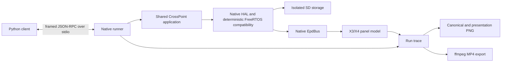

# X3/X4 Emulator Plan

## Decision

Build a deterministic, host-native emulator that compiles the same CrossPoint application, activity, EPUB, rendering,
settings, and persistence sources as the firmware. PlatformIO selects native implementations at the existing hardware
and system boundaries; emulator conditionals do not spread through application code.

The emulator models the X3 and X4 as explicit device profiles. Python owns a headless emulator subprocess and controls
it through a versioned framed JSON-RPC protocol over standard input/output. Tests mutate the device only through physical
controls, reset/power, simulated time, and isolated SD contents. Narrow read-only automation signals provide reliable
activity, render, panel, timing, scheduler, and storage waits.

This is a calibrated behavioral emulator, not an ESP32 firmware-binary or electrochemical simulator. Determinism and
source parity take priority over instruction-level fidelity. An initial single-device X4 profile is measured and marked
provisional; X3 and population/temperature profiles remain deferred until physical data exists.

### Persistence compatibility decision

Cache paths use a project-owned fixed 32-bit hash that reproduces the ESP32-C3 toolchain's existing libstdc++
`std::hash<std::string>` result. Native builds must not use the host's 64-bit `std::hash`: that would create different
`epub_<N>` directories, miss device caches, and strand `progress.bin` in host-only paths. Persisted formats continue to be
read and written by shared firmware code; native storage does not translate them. The host function computes
`2952540565` for `/stormlight.epub`, matching the cache directory emitted by the attached ESP32-C3 during a physical cold
open.

### Capture and presentation decision

Canonical panel and framebuffer PNGs retain controller-native geometry and are compared as decoded grayscale pixels,
not compressed PNG bytes. `capture.screenshot` and MP4 presentation rotate those pixels 90 degrees clockwise into the
natural handheld orientation. System zlib keeps stored artifacts compact, while pixel-plane comparisons avoid false
golden failures when the zlib implementation changes.

### Trace observability decision

Trace v2 records each calibrated high-level boundary as `timing.applied`, including its selected model, target, elapsed
simulated work, and remaining modeled interval. Direct boundaries block for that remainder; controller BUSY instead
schedules it as a deadline. Repetitive SD read/write/seek calls are retained as deterministic per-path
`storage.summary` records rather than hundreds of thousands of byte-level events; calibrated SD costs are similarly
collapsed by model in `timing.summary`. Open, close, directory, control, render, panel, and capture events remain ordered
in the canonical trace, so a large cold EPUB stays explainable without turning one run into a tens-of-megabytes log.

### Physical calibration capture decision

Measure hardware with a calibration-only firmware build and an ordinary Python script, not a second scenario language.
The build exposes USB-serial button state, markers, and device timestamps through the existing command channel; injected
buttons enter FreeInk's normal state hook and therefore retain the production debounce and mapping path. A host command
starts FFmpeg, records the naturally oriented webcam view, runs the script, and preserves raw serial traffic plus
host/device timestamps beside the MP4. Direct commands that change activity reset the same production inactivity timer
as user input, so an idle Home screen cannot make scripted opens run at a lower CPU frequency. Normal firmware builds do
not contain the calibration commands. Synchronous cache, SD, directory, panel, and grayscale commands restore normal CPU
frequency before starting their measured boundary; otherwise CPU and SPI timing inherit the idle clock.
The same CLI has a dedicated boot capture that starts the camera, hard-resets through PlatformIO's esptool environment,
opens serial before application startup, records through Home's low-power boundary, and then sends a harmless Back input
to leave the attached device awake. Failed resets remain complete failed artifacts rather than being overwritten.
Capture manifests distinguish requested/encoded CFR from the pre-encoder source cadence derived from FFmpeg timestamps;
duplicated frames must not be presented as extra optical resolution.

### Timing profile decision

Use p50 for nominal timing, p90 for the initial tolerance boundary, and MAD to expose dispersion. Keep render phases,
whole panel-operation time, controller busy waits, and webcam-visible waveform evidence separate: X4 refreshes retain
the old image and pass through target-dependent intermediate states, so one opaque "refresh delay" would reproduce
neither responsiveness nor review video. Profiles from one unit/SD card are provisional and do not enable performance
assertions; temperature and cross-device variance remain explicit gaps.

The runtime reads the versioned X4 JSON rather than duplicating nominal numbers in Python or C++. It applies controller
BUSY at the panel bus, generic SD costs at `HalStorage`, render and image costs at their existing HAL/application
boundaries, and the cold-index total at the EPUB index boundary. Derived image caches use the directly measured cached
render duration rather than the generic SD benchmark because the physical paths have materially different throughput.
Root-directory open and enumeration use their own measurements rather than the regular-file open cost; EPUB text-layout
pacing is likewise scoped to the EPUB page renderer instead of every screen that calls `HalDisplay`.
Activity timing stays split at the same boundary visible in firmware logs. Two dedicated current-SD/current-firmware X4 traces
measure File Browser at `38` ms from entry to display and all 26 paints at `26` ms, so native execution pads the `12` ms
setup and `26` ms paint remainders separately. These traces supersede the older `28/18` ms File Browser samples for this
provisional profile rather than pooling different root contents and calibration revisions; the older library trace
remains the source for Home's `72/12` ms first/later paints.
An independent reversible capture removed all nine recent books, measured empty Home at `10/9` ms, then restored the
original order one book at a time. Populated first paints span `68-81` ms according to the displayed top book/cover while
later paints stay at `10-14` ms, so this is not a count-linear population curve. Keep `72/12` ms as the central populated
screen compromise; content/population-specific profiles remain deferred rather than adding an unsupported discriminator.
Those paint targets consume only the remainder after native rendering and storage, rather than being added as opaque
delays. Older schema-version-1 profiles without these optional paint records keep their previous behavior.
Repeated settled Home controls measure `20` ms p50/p90 with `0` ms MAD from physical-button acknowledgment to paint
start; eleven of twelve samples are exactly `20` ms and one scheduler outlier is `79` ms. The emulator's real
GPIO/debounce path produces `20` ms for all thirteen comparable presses, so the control run remains attributable evidence
and no separate input-delay constant is added.
Nine Recent Books long presses enter Confirmation in `1,020-1,117` ms (`1,025` ms p50) after physical Confirm-down.
The emulator reaches the same activity at about `1,020` ms through the production 1,000 ms hold threshold, so hold timing
is likewise evidence-only rather than another profile delay.
Two settled current-firmware Settings captures measure both first full paints at `27` ms and twelve later full paints at
`35-36` ms (`36` ms p50/p90). Option popups reuse the existing framebuffer and do not call `clearScreen`, so their old
clear-to-display diagnostic intentionally accumulates and is not a paint sample. The runtime records whether the current
activity render cleared the screen: main Settings renders consume the first/later targets. Two later current English
Reader Font Size repeats use the calibration-only activity boundary and measure 14 popup paints at `7` ms p50/p90,
`0` ms MAD, and a `6-7` ms range. One `7` ms non-clearing Settings floor avoids popup-type state; translated and other
option sets are uncalibrated but share that provisional floor, and a heavier native overlay is never shortened. The new
runs' incidental `28/36` ms full paints remain evidence-only so adding the popup cannot silently retune the accepted
parent-screen model.
Two reversible Reader-navigation captures measure the current Stormlight menu, without optional Footnotes or Bookmarks
rows, at `20/21` ms for its first paint and exactly `19` ms for all twelve later paints. Those clear-and-redraw renders
use separate first/later targets. Optional-row variants and the measured `74-75` ms Stormlight chapter list remain
evidence-only because their strings and population vary; fitting them is part of the deferred content/population work.
Reader `OptionPopup` overlays need a narrower boundary because they reuse the framebuffer and never reset the old
clear-to-display diagnostic. A calibration-only activity timestamp measures the first `displayBuffer()` in each render
before panel I/O and compiles out of normal firmware. Two current English Orientation/Auto Turn repeats yield 28 paints:
Orientation is `8` ms nominal and Auto Turn is exactly `7` ms, so one `7.5` ms pooled Reader-menu overlay target stays
within `0.5` ms of either without popup-type state. Popup Back is handled on press and the same release exits the menu;
the capture and replay both wait for that clear Reader repaint before reopening the menu. Translated labels remain
deferred, and padding remains a floor that never shortens a heavier native overlay.
Two further reversible captures measure the English `Go to %` selector at exactly `7` ms for both first paints and
`6` ms p50 / `7` ms p90 across 24 later paints at `0`, `1`, and `10` percent. The runtime exposes
`reader.epub.percent` and pads only this activity's clear-and-redraw remainder. The scenario restores zero before Back
cancels, so it neither commits progress nor changes the SD; translated selector layouts remain deferred evidence.
Every production panel entry point consumes its measured whole display interval. FAST/HALF `displayBuffer()` calls use
the natural Reader phase measurements; direct FULL calls in Boot and Sleep use the controlled full-operation measurement.
The X4 single-buffer driver splits the measured non-BUSY remainder around controller BUSY using its actual plane sequence:
FAST writes one plane before activation and re-seeds two afterward; HALF/FULL write two before and two afterward. Blocking
calls retain the same whole interval, while async calls correctly omit the post-refresh re-seed. Active display intervals
shorter than their BUSY component are rejected. `HalDisplay::refreshDisplay()` is calibration-only in current firmware,
so normal emulator builds do not carry a second unreachable operation-floor hook.
Generic reads retain fixed open/close costs plus the measured 512 KiB linear rate, which predicts the corrected 4 KiB,
64 KiB, and 512 KiB totals within `1%`. Writes have a repeatable `6,145 us` first-transfer setup in addition to linear
payload time. Applying that setup once on the first non-empty write after open predicts all three corrected write totals
within `0.23%`; it does not inspect or infer the file's eventual size.
Five physical JPG Home-thumbnail boundaries cover 43,333-305,810 decoded bytes and 886-3,608 ms. A linear whole-workload
model (`435,868 us + 10,590 ns * imageBytes`) stays within `9.38%` of every sample. Generic transfer pacing is suspended
inside the boundary to avoid charging for the same bytes twice. Four controlled RGB8 PNG covers span `321x482` through
`1284x1927` at the fixed `135x226` Home target. Their preparation phase fits
`48,615 us + 6,975 ns * imageBytes` within `0.973%`; conversion fits
`120,586 us + 2,168 ns * sourcePixels` within `4.359%`. Runtime applies each phase only inside its measured byte/area
range, and conversion additionally requires RGB8 plus the measured target. Other formats, targets, and extrapolated
sizes retain ordinary fallback timing instead of inheriting an unsupported curve.
The single Stormlight cold-index observation applies only to the existing large-spine path (400 or more documents), not
to small EPUBs. Its existing OPF, TOC, and book-bin fields are also consumed at their production log boundaries. Generic
SD pacing remains active for OPF and book-bin, where native work stays below hardware; it is suspended only for TOC,
where thousands of small writes otherwise make the linear bulk-transfer model exceed the whole measured phase. Each
phase pads only its remainder, and the total remains a final safety boundary.
Controller completion, driver return, and visible e-ink state remain distinct: the controller reaches its measured BUSY
boundary, the blocking X4 driver re-seeds its two RAM planes, and only then does application execution continue. Trace/MP4
frames independently use the target-dependent optical schedule. The measured X4 schedule models
fast/half onset and settling, full-refresh charge pulses, and light/dark grayscale settling after a fast primary. Ten
normal-speed grayscale operations after a half primary produced no camera-visible change above the controlled threshold,
matching the firmware warning that half refresh sets particles too firmly for that LUT. The model retains the half-settled
panel through the grayscale BUSY interval instead of inventing a transition. Camera-derived brightness is retained as
evidence rather than treated as canonical panel pixels.
Half-primary reader phases come from a controlled every-page-refresh run with nine natural text-page samples; image-heavy
fast-primary renders remain separate workload evidence rather than widening that distribution. Those same nine samples
show the half-refresh waveform's inverted new-page drive at `352.557` ms p50 and target transition at `1,097.179` ms.
Twelve baseline-cadence fast pages show a direct transition from `266.196` to `309.576` ms p50. Panel model v3 uses
these reader-content schedules while retaining the controlled full-screen measurements as separate evidence.
Eight independent full-cover fast samples show a longer image-content window: lighter direct drive begins at `248.283`
ms p50 and settles at `342.846` ms. The profile records a conservative majority-dark selector: observed cover targets are
over 72% dark and text/control targets stay below 7%, so only targets with at least 50% dark pixels use the image schedule.
This keeps content selection inside the panel model instead of adding an EPUB-specific rendering hook.
An independent validation run sets the configured cleanup cadence to every page, then records nine full-cover operations
before restoring the 15-page baseline. Image pages deliberately remain on the production double-FAST blank/restore path:
HALF would prevent the following grayscale LUT from adjusting the particles. The repeat's `254.012/334.228` ms p50
start/end boundaries and the pooled 17-sample `253.734/337.073` ms boundaries differ from the applied values by less than
9 ms, below the camera's 40 ms source-frame resolution. The profile therefore retains one image-FAST schedule and does not
invent an image-HALF mode or retune on sub-frame movement.
All five profile optical inputs from this webcam have a 25.0 FPS decoded cadence despite 30 FPS CFR outputs. Their
source-frame intervals are `40.0` ms p50 and `40.1` ms p90, so profile evidence now states 40 ms quantization without
changing any measured transition p50. A 60 FPS request produced the same 25 FPS source cadence and was rejected as
higher-rate evidence rather than treating duplicated frames as measurements.
The X4 Python client selects the provisional profile by default; standalone native runs remain uncalibrated unless given
`--timing-profile`, and X3 stays uncalibrated.
The consumption audit treats only nominal p50 boundaries as runtime inputs. p90/MAD, camera luma, dominant-change peaks,
pooled/aggregate phase totals, alternate-size SD samples, XL pages, mixed cold-page distributions, and corpus Home metadata
loads observed amid thumbnail work remain tolerance or scenario evidence; turning them into additional delays would
double-count canonical phases or generalize content from one run. Directory close totals are already reproduced by the
per-file generic close cost rather than a second directory constant. The exact indexing, warm-open, and image tables are
runtime inputs, not evidence-only duplicates: they are selected before the documented fallback timings. Warm-open records
key only the cached-metadata and metadata-start-to-page-load phases by device path; open-to-ready remains scheduling and
tolerance evidence so it cannot be charged a second time. Exact warm-open scopes treat their small metadata/progress I/O
as part of the measured whole workload instead of also charging the bulk generic SD model; renamed and unmeasured books
retain generic storage pacing and the large-spine fallback.
Scenario-only workload repeats are stored separately from runtime-model inputs. This keeps their raw phase distributions
and source manifests attributable without silently changing unrelated image, section, or cache fits.
Cache clearing remains the production `Epub::clearCache()` mutation, paced as one synchronous workload boundary. A
missing cache uses the seven-sample `6,471 us` p50; populated caches use
`74,036 + 17,504 * fileCount us`, fitted over eleven observations with `12.894%` maximum absolute relative error. File
bytes are not monotonic with duration, and every
populated observation has three directories, so adding byte or directory coefficients would overfit this one-device data.

### Distribution and extension decision

Ship calibrated timing JSON as Python package data and keep the native runner as a separately built platform artifact.
The package must work outside this checkout: executable discovery uses an explicit argument/environment override or a
surrounding source tree, never fixed parent counts from the installed module. Do not put the current Linux-native 10 MB
runner in a platform-independent wheel; release binaries can be added later as correctly tagged per-platform artifacts.

User automation remains ordinary, self-contained Python. A script launches `Emulator`, owns its fixtures and artifacts,
requests screenshots where useful, closes the session, and may then export the recorded trace to MP4. The installable
`crosspoint-emulator` command only executes that script with optional runner/profile overrides, which supports isolated
`uvx` use without inventing a scenario DSL or a second configuration model. Physical calibration and profile analysis
stay maintainer tooling rather than public automation abstractions: serial/webcam classes live under
`crosspoint_emulator.hardware`, and pyserial is installed only through the `calibration` extra.

Derived selectors that would otherwise be recovered from raw workload records belong under the profile's explicit
`models` object. Raw workload records remain provenance and evidence, not an order-dependent runtime configuration
surface. Older schema-version-1 profiles retain their original workload fallback when an explicit model is absent.

### Why this direction

- CrossPoint already routes display, input, storage, clock, power, system, and tilt behavior through `lib/hal/`.
- The real X3 and X4 panel drivers already contain the difficult refresh promotion, retained controller-RAM, grayscale,
  resync, and power-state behavior. Native builds should reuse those state machines through a native `EpdBus`.
- Host-native execution makes scheduling, time, fixtures, captures, and failure artifacts controllable and reproducible.
- The same application sources prevent a separately implemented emulator UI from drifting away from firmware behavior.

### Rejected foundations

- **ESP32-C3 QEMU:** CrossPoint PR
  [#500](https://github.com/crosspoint-reader/crosspoint-reader/pull/500) proved framebuffer, SD, input, and web control,
  but suffered random watchdog failures and unsupported GPIO/peripheral paths. QEMU instruction counting is deterministic,
  not cycle-accurate, so it cannot supply trustworthy device-speed fidelity by itself.
- **Wokwi:** useful prior art for Python lifecycle/peripheral automation, but it introduces a hosted token dependency and
  still requires custom SSD1677/UC8253 behavior.
- **Physical ESP32-C3 execution:** useful later as a calibration and conformance backend, but unsuitable as the required
  engine for local and CI tests.
- **Separate SDL/web application:** the PlusPoint proof of concept shows that native display/input is viable, but a parallel
  application shell would duplicate and drift from CrossPoint.

## Goals

- Run the real CrossPoint reading flow on Linux/WSL without Xteink hardware.
- Select X3 or X4 explicitly for every run.
- Reproduce device geometry, capabilities, display-controller state, e-ink refresh phases, retained panel state, and
  deterministic approximate ghosting.
- Mount an isolated SD fixture, exercise real persistence/cache code, and preserve hardware byte compatibility.
- Inject physical press, hold, release, power, and reset inputs.
- Provide Playwright-like synchronous Python control with explicit waits and useful failure artifacts.
- Capture both composed framebuffer pixels and simulated visible panel pixels.
- Record a replayable structured run trace and derive deterministic presentation PNGs and MP4 from it.
- Run unpaced for tests or wall-clock-paced for interactive observation without changing simulated results.

## Deferred work

- Hardware-calibrated X3 timing and population/temperature X4 timing profiles.
- Performance assertions that claim device-speed accuracy.
- Exact ESP32 heap capacity, fragmentation, and OOM behavior; milestone 1 only reports emulator-owned allocations.
- Wi-Fi, OPDS, OTA, Calibre, USB-state, battery, RTC-device quirks, and X3 tilt behavior beyond deterministic stubs.
- Pixel-exact physical ghosting, voltage-level or electrochemical panel simulation, and temperature effects.
- Device surrounds, physical-button overlays, and timing overlays for presentation output.
- Native Windows/macOS packaging, a live interactive GUI, and remote attachment to an existing emulator process.
- Seeded scheduling, storage-fault, and slow-device stress profiles.

## Architecture



### Build and source boundaries

- Add a PlatformIO native environment dedicated to the emulator.
- Compile the normal `src/` application and internal libraries in that environment.
- Select alternate implementation files for HAL, Arduino/ESP compatibility, FreeRTOS compatibility, and `EpdBus` at
  build time. Do not add runtime virtual dispatch to the firmware build.
- Keep the headless runner, protocol, models, and native compatibility code under an `emulator/` tree.
- Keep the `uv`-managed Python package under `emulator/python/`, with type annotations and strict Pyright checking.
- Changes needed to make the real panel drivers work with a native `EpdBus` belong in `freeink-sdk`; update this repository's
  submodule pin only after those changes are independently verified.

Proposed shape:

```text
emulator/
  native/                 native runner, protocol, scheduler, HAL/platform implementations
  profiles/               versioned development and later calibrated profiles
  python/
    pyproject.toml
    src/crosspoint_emulator/
test/emulator/
  fixtures/               immutable SD fixture inputs
  goldens/x3/             canonical panel PNGs
  goldens/x4/
```

### Deterministic time and scheduling

- One simulated clock is authoritative for firmware-visible time, device costs, traces, and video.
- Tests run unpaced; interactive execution may pace simulated time at 1x or another multiplier.
- MP4 duration comes from simulated time, never host execution time.
- Native FreeRTOS compatibility serializes execution as a deterministic single-core scheduler. Host threads may hold task
  stacks, but only one emulated task runs at a time.
- Scheduling points are FreeRTOS boundaries: task notification, semaphore, queue, delay, and yield.
- Runnable ties resolve by priority and creation order.
- Each automation wait has both a simulated-time timeout and a larger wall-time deadlock watchdog.
- RTC start, random seed, filesystem ordering, locale, and timezone are explicit run inputs recorded in the manifest.

Milestone 1 uses clearly named, uncalibrated development timing. It must not expose performance assertions or describe
those timings as X3/X4 speed measurements.

### Device profiles

Every launch requires `x3` or `x4`; native mode bypasses I2C hardware fingerprint probing.

| Property | X3 | X4 |
| --- | --- | --- |
| Panel geometry | 792x528 | 800x480 |
| Controller | UC8253 | SSD1677 |
| Panel driver | Real `Uc8253X3Driver` | Real `Ssd1677Driver` |
| Profile selection | Explicit run input | Explicit run input |

Later profile versions add calibrated CPU/rendering, SD, and panel timings without changing the protocol or application
boundary.

### Panel behavior

The native `EpdBus` consumes the real panel drivers' command/data traffic and maintains:

- controller B/W and secondary RAM planes;
- loaded waveform/LUT identity and refresh mode;
- power, deep-sleep, BUSY, initial-sync, and resync state;
- visible grayscale panel state distinct from controller RAM and the application framebuffer;
- refresh history used by deterministic retention/ghosting approximations;
- time-resolved transition phases for panel recordings.

The panel model reproduces observable full/half/fast/grayscale behavior and intermediate flashes. It does not claim
pixel-exact physical artifacts. Panel-model and profile versions are included in every trace and capture.

A new run records an explicit initial panel state: white by default, or black/a supplied PNG. `reset()` and sleep/wake
clear volatile execution state while preserving SD and visible panel contents. A fresh run creates new isolated storage
and initial panel state.

### Storage

- An SD fixture is an immutable host directory used as the initial card contents.
- Each run receives a private writable copy; the fixture is never modified.
- The native `HalStorage` implementation enforces deterministic enumeration and the application-visible FAT32 path/name
  constraints needed by CrossPoint.
- All storage operations emit trace events. Timing/fault costs are injected by later profiles.
- Do not emulate SD blocks or require a FAT image in milestone 1.
- Persisted settings, progress, metadata, and section cache files remain byte-compatible with hardware. Fix host-ABI
  dependencies in shared serialization rather than translating formats in native storage.

### Inputs and observability

The protocol injects and records physical controls:

- four bottom-edge buttons;
- volume up and volume down;
- power;
- reset.

Logical helpers such as `press_action("confirm")` may resolve the current mapping, but must inject the resulting physical
button. This keeps remapping, orientation, debounce, holds, and combinations on the real application path.

Supported screens gain a small shared `ActivityId` enum with stable protocol names such as `boot`, `home`, `file_browser`,
and `reader.epub`. Do not expose C++ class names or free-form activity labels as automation contracts.

Initial explicit waits:

- `wait_for_activity(id)`;
- `wait_for_render(after=generation)`;
- `wait_for_panel_idle()` (render task, controller BUSY, and scheduled optical settling);
- `advance(duration)`.

Storage operations are synchronous and complete before their protocol response, so a storage-idle wait would be a no-op.
There is no generic `wait_for_idle()` because background work makes global idleness ambiguous.

### Protocol and Python API

- Python owns the subprocess lifecycle.
- Use a versioned framed JSON-RPC protocol over stdin/stdout; emulator logs go only to stderr.
- Begin every connection with a compatibility handshake containing protocol, trace, device-profile, and panel-model
  versions plus the run artifact directory.
- Responses and asynchronous events share the framed channel and carry monotonically increasing sequence numbers.
- Large images/traces/video are written under the artifact directory and referenced by path, not base64-encoded in the
  control channel.
- Keep the protocol transport-neutral so a future interactive viewer can use a WebSocket adapter without changing
  semantics.

The initial Python surface is synchronous and library-first:

```python
with Emulator.launch("x3", sd="test/emulator/fixtures/library") as device:
    device.wait_for_activity("home")
    device.press_action("confirm")
    device.wait_for_panel_idle()
    device.capture_panel("home.png")
```

Provide optional thin pytest fixtures, but no YAML scenario DSL, mandatory pytest plugin, or async API in milestone 1.

### Trace, captures, and video

The run trace is the canonical recording and contains:

```text
run/
  manifest.json            versions, profile, seed, RTC, fixture identity, environment
  events.jsonl             simulated-time controls, signals, spans, storage, scheduler, panel events
  frames/                  deduplicated canonical panel PNGs referenced by events
  captures/                explicitly requested framebuffer/panel captures
  presentation/            derived framed/scaled captures and MP4
  stderr.log
```

- Canonical framebuffer captures contain composed 1-bit pixels before refresh behavior.
- Canonical panel captures contain native-geometry visible grayscale state and are visual-test truth.
- `capture.screenshot` writes a human-review presentation PNG rotated into the natural handheld orientation; canonical
  framebuffer and panel captures stay in controller-native orientation.
- Other presentation captures may scale, add an X3/X4 surround, show button presses, or overlay timing.
- MP4 is generated from the trace with the system `ffmpeg` CLI. Record encoding arguments and FFmpeg version.
- Trace and PNG features work without FFmpeg; video export reports a clear missing-dependency error.
- Commit compact canonical X3/X4 PNG goldens. Do not commit MP4 goldens; validate generated video duration and frame count.
- Keep timing assertions separate from image assertions.

## Implementation phases

Each phase should remain independently buildable and reviewable. Refactors and behavior changes should be separate commits.
Phases 2–6 were ultimately published together as `440efd3d`; retain that published history rather than force-pushing it,
and keep subsequent cleanup in separate reviewable commits.

### 1. Native execution spine

- Add the PlatformIO native environment and headless `main()` runner around the existing `setup()`/`loop()` lifecycle.
- Add the protocol framing, version handshake, stderr logging separation, explicit X3/X4 selection, and artifact root.
- Add the minimum Arduino/ESP compatibility needed to compile shared application code.
- Add deterministic clock and single-core FreeRTOS task/notification/semaphore/delay behavior.
- Provide native system, clock, power, tilt, and GPIO boundaries with explicit unsupported operations.

Exit criteria:

- Both profiles launch and complete the protocol handshake on Ubuntu/WSL.
- Two identical no-op runs produce the same normalized event sequence.
- A stalled task trips the wall-time watchdog with scheduler diagnostics.

### 2. Isolated storage and boot

- Implement directory-backed `HalStorage` and `HalFile` with isolated run state, deterministic enumeration, and tracing.
- Load real settings/state/recents from an SD fixture.
- Audit persistence code for host-ABI-dependent serialization and preserve documented on-device formats.
- Reach a stable Home activity using shared application sources.

Exit criteria:

- Fixture contents remain unchanged after a run.
- Reset preserves run storage; a fresh run starts from the fixture.
- Emulator-created persisted files round-trip through existing firmware readers and format checks.

### 3. Native display bus and panel model

- Make the FreeInk X3/X4 panel drivers host-buildable without changing their firmware behavior.
- Add the build-selected native `EpdBus` and controller RAM/state interpretation.
- Model initial panel state, power/BUSY intervals, refresh promotion, full/half/fast paths, grayscale, resync, retention, and
  deterministic approximate ghosting.
- Emit canonical framebuffer and panel captures at native X3/X4 geometry.

Exit criteria:

- Real X3/X4 driver call sequences produce distinct, expected panel traces.
- Reset and sleep/wake retain visible panel state.
- Repeated runs produce byte-identical canonical captures.

### 4. Input and automation signals

- Inject physical press/hold/release combinations through the native GPIO path with real debounce semantics.
- Add stable `ActivityId` values only for the supported vertical slice.
- Emit render generations, activity changes, panel BUSY/idle, storage activity, timing spans, and scheduler diagnostics.
- Implement explicit wait commands and dual simulated/wall timeout behavior.

Exit criteria:

- Remapped buttons and holds exercise `MappedInputManager`, not an emulator shortcut.
- Python can deterministically wait from boot to Home and through a panel refresh.

### 5. Python client and EPUB vertical slice

- Create the `uv`-managed, strictly typed synchronous Python package and context-manager lifecycle.
- Add optional pytest fixtures and automatic failure-artifact retention.
- Add a minimal SD fixture containing an existing small EPUB test asset.
- Drive Home/library/open/page-turn entirely through device controls on X3 and X4.
- Add canonical panel PNG goldens and semantic trace assertions.

Exit criteria:

- One Python scenario completes `launch -> Home -> library -> EPUB -> page turn` on both profiles.
- Two runs with identical inputs produce identical normalized traces and panel goldens.
- Ubuntu CI builds the native target and runs the scenario headlessly.

### 6. Recording and presentation

- Persist the canonical trace, deduplicated panel transition frames, and manifest.
- Add deterministic trace replay and fixed-FPS sampling.
- Rotate replay output into natural handheld orientation; richer optional presentation overlays are deferred.
- Export MP4 through FFmpeg and validate duration/frame count without committing video binaries.

Exit criteria:

- The EPUB page-turn scenario exports an MP4 for both device profiles.
- Re-encoding the same trace uses the same simulated duration and visual frame sequence.
- Changing presentation FPS requires no emulator rerun.

### 7. Later calibration and fidelity

- Add a calibration-only serial control build and a host capture harness that records MP4, serial logs, commands, and
  synchronization metadata as one run artifact.
- Reuse the reader's existing phase-level render logs, and measure controlled full-screen panel transitions plus
  sequential SD reads/writes through calibration-only commands. Buffer benchmark results until the measured operation
  completes so serial output is outside the timed interval.
- Include warm text paging, cold and warm loading of the largest fixture, uncached/cached image rendering, and one
  settings-driven pagination variant. Enter named books through the production reader path; change settings through the
  physical Settings UI and restore the baseline after capture.
- Capture repeated phase-level traces from physical X3 and X4 devices using the same scenarios and trace vocabulary.
- Commit versioned nominal timing profiles for CPU/rendering, SD operations, and panel transitions.
- Enable performance assertions only after profile variance and tolerances are documented.
- Add a deterministic constrained allocator, seeded schedule/storage stress, secondary hardware, networking, and additional
  host platforms as separate work.

Current status: the capture, analysis, and profile path is complete for one X4 and its SD card, and the versioned profile
is active in the Python emulator. Performance assertions, X3 capture, population/temperature variance, and broader
content-specific optical calibration remain deferred. The current same-firmware Stormlight core run measures `23,082` ms
cold indexing. Three isolated repeats on the same X4 extend that point to four samples: measured p50s are `23,081` ms
total, `5,112` ms OPF, `2,009` ms TOC, `15,966` ms book-bin, and `1,111` ms post-index load. Total indexing ranges from
`22,778` to `23,256` ms with `88` ms MAD. The independently rounded phase p50s sum to `23,087` ms, so that sum is the
runtime total floor rather than claiming an impossible six-millisecond-shorter composite. These are content-specific
workload boundaries, not a general CPU simulator.
A quiescent Stormlight warm-open capture established the original `558` ms cached-metadata and `1,586` ms
metadata-start-to-page-load fallback. The first isolated repeated captures were invalid nominal evidence: Home had entered
low-power mode before each direct `CAL:OPEN`, which bypassed the physical input path that normally restores CPU speed.
Activity-changing calibration commands now reset the ordinary inactivity timer before the pending transition. Corrected
Stormlight/WOT/Sun Eater/Mistborn/LOTR records are `58/160/72/56/56` ms for cached metadata and
`206/306/225/201/202` ms from metadata start to page load. Exact paths select these records before the old large-spine
fallback; renamed EPUBs retain the fallback. The profile preserves p90/MAD and open-to-ready as evidence, but does not
pace the host serial round trip as another runtime delay.
The original image application mixed scopes and sizes: physical cached-render logs begin after file open, while the
emulator started before a generic `102.5` ms open and applied the pooled `131.5` ms p50 to every image. The accepted log
contains 50 attributable end-to-end cache samples: `20.5` ms p50 for ten small caches and `147` ms for forty full-page
caches. Decode/cache has four source-correlated samples: `73/81` ms for `1,073/1,256` bytes, `1,079` ms for `66,507`
bytes, and `1,871` ms for `290,426` bytes. The runtime now suppresses generic SD pacing only for derived image files and
selects cached timing by displayed area. Later captures expand decode/cache to ten exact source-byte/output-dimension
records; unmatched images retain the three observed source-byte tiers rather than inheriting a fitted curve.
The deterministic six-page replay preserves byte-identical settled rasters while exercising the cover, medium full-page,
and two small-image pages; the thresholds remain workload-specific until a larger physical corpus supplies more points.
Cold-open phase review then isolated two earlier boundaries hidden by the correct indexing total. Physical CSS parse/cache
reload from `Total indexing completed` to reloaded metadata is `1,098` ms; generic small-file pacing made the emulator
`3,545` ms. The explicit post-index scope now lands exactly at `1,098` ms, making Reader-entry-to-EPUB-ready `25,046` ms
versus `25,148` ms physical. Image preparation from `Found image` through decoded dimensions is `1,736/443/158-161` ms
for large/medium/small inputs; the corresponding emulator phases are now `1,736/443/159.5` ms. Reader-entry through the
first painted cover is `33,434` ms versus `33,216` ms physical, leaving a `218` ms end-to-end residual rather than the
previous multi-second ZIP/CSS overcharge.
An every-page-refresh run replaces the original two-sample half-primary estimate with nine samples: `2,622` ms p50 total,
`2,650.8` ms p90, `1,723` ms primary BUSY, and `144` ms grayscale BUSY. A later slowed Settings run restored and
behaviorally verified the normal 15-page cadence after the first restore attempt missed a repainting row.
A later profile-consumption audit found that only the half BUSY/display values were selected at runtime while the CPU and
grayscale transfer phases still came from the fast sample. Fast and half now have separate complete render timing records.
The corrected deterministic half replay is `2,625` ms total, within `3` ms of physical p50, while the fast control remains
`1,186` ms, within `3.5` ms of its physical p50. This applies existing measurements and does not add a content multiplier.
Corrected normal-speed root calibration over the populated X4 SD measures `12` us p50 to open `/` and `291` us per
`openNextFile` call. That removes the earlier idle-clock artifact but exposes the File Browser's unmodeled CPU work: raw
emulation reaches display in `3-4` ms. An older calibration revision measured `28/18` ms whole/paint timing, but two
dedicated current-firmware repeats independently measure the whole boundary at exactly `38` ms and all 26 entry/selector
paints at exactly `26` ms. The profile therefore supersedes the old File Browser samples and splits `38` ms into `12` ms
setup plus `26` ms paint, instead of pooling captures into a whole duration shorter than its paint. The older camera
capture shows 13 root rows; the current capture shows 15 visible rows plus a scrollbar, so the `8` ms paint difference
cannot be attributed solely to firmware. This single-SD nominal follows the current accepted test corpus; a count/content
curve remains part of the deferred population profile. Five
return-to-Home samples independently measure the first paint at `72` ms, with one initial `71` ms sample; all six
automatic follow-up paints are `12` ms. The emulator now reproduces `72/12` ms Home paints and current File Browser
timing at exactly `38/26` ms without falsifying directory I/O. The aligned, perspective-corrected
review also preserves the remaining optical difference: hardware is lighter and softer, while the digital model exposes
hard halftone dots and stronger retained-image ghosting. The physical SD currently has three visible entries not present
in `books-for-testing/` and lacks `malazan-big.epub`, so this comparison validates layout and waveform rather than an
identical filename raster.
The earlier accepted XL-font capture also covers Settings navigation and the Reader Font Size popup. Its overlapping
500 ms cadence established the queued render order, but could not isolate the raw paints. Two later settled repeats
measure `27` ms for first paint and `36` ms p50 for later full redraws. Two calibration-hook repeats then isolate the
framebuffer-reusing Reader Font Size overlay at `7` ms across entry and paired Down/Up controls. Runtime distinguishes
clearing parent paints from non-clearing popup paints and consumes each target only as an unspent floor; a
physical-cadence replay preserves the established queue order. The current 0.9-second aligned popup-entry review matches
bounds, title, option rows, selection, underlying Settings layout, and soft keys. The fixture's font-family value differs
from the device SD, while hardware remains softer/lighter and the digital panel retains crisp halftone and stronger ghost
detail.
The later Reader-navigation repeats are also naturally upright. They show the same stable Reader menu and Select Chapter
layouts on both runs; emulator scripts can synchronize at those nested screens through explicit `reader.epub.menu` and
`reader.epub.chapters` activity IDs instead of polling pixels or log text.
The accepted Reader-percent repeats are likewise naturally upright and cancel after returning the selector to `0%`.
Two deterministic emulator replays reproduce `7/6` ms first/later paints and expose `reader.epub.percent` as a stable
wait target. Their aligned entry review matches the header, percent value, slider, control hints, and soft-key geometry;
the physical panel remains lighter and softer while the emulator retains a crisp, stronger ghost of the Reader menu.
The later Orientation and Auto Turn popup repeats use a calibration-only render-start marker because neither overlay
clears the framebuffer. Their pooled `7.5` ms target is consumed exactly by two deterministic emulator replays, including
popup entry after Confirm release and all twelve selector moves. Aligned 0.8-second entry reviews match popup bounds,
titles, option rows, selected state, underlying Reader menu, and soft keys. Hardware remains gray, soft, and uneven;
the emulator remains crisp, higher-contrast, and more strongly ghosted. The value-preserving scenarios also expose the
production Back fallthrough without adding a popup activity ID or popup-type timing branch.
Two later normal-speed XL runs reproduce the panel boundaries: fast-primary BUSY is `506/62` ms and half-primary BUSY is
about `1,723/144` ms for primary/grayscale. Their whole fast-page medians differ (`1,230` versus `2,089.5` ms) because the
sampled content and display work differ. The repeat is therefore retained as scenario evidence, excluded from every
runtime fit, while the script's final marker and video confirm that Settings restored Medium.
Application-level deep sleep now follows the production Power-hold path through state persistence, the entering-sleep
popup, the configured sleep screen, panel deep sleep, and a blocked firmware task. Protocol control remains live so a
test can capture the retained panel and model wake as the existing reset/relaunch boundary. The X4 profile produces a
`747` ms popup fast operation followed by the measured `3,743` ms full operation.
Two identical sleep-to-reset replays produce byte-identical traces, visible-panel snapshots, and videos, and the reset
snapshot is byte-identical to the settled sleep panel. The accepted physical pulse run auto-releases Power inside GPIO
sampling, records the deep-sleep boundary, and then observes the real USB detach. Device receipt to deep-sleep log is
`5,371` ms; the profiled emulator deep-sleep event is `5,426` ms. Sleep activity entry to deep sleep is padded to the
measured `4,809` ms. The aligned 60 FPS review confirms matching logo/text geometry and the expected optical difference:
hardware black is lighter/noisier and its white mark is softer than the digital panel.
An independent hard-reset audit then exercised Boot's direct full `displayBuffer()` path. The attached X4 entered Boot at
`440` ms, completed the full refresh at `4,348-4,349` ms, entered Home at `4,513-4,514` ms, and completed its two Home fast
refreshes at `5,179-5,183` and `5,946-5,949` ms across five captures. Charging the existing `316,843 us` full-operation
remainder reduced emulator residuals at those boundaries from roughly `381-462` ms to `64-145` ms. The camera and emulator
both show the retained Home screen, upright Boot mark, then Home; the physical screen remains softer/lighter and the
fixture content differs. Three automatically aligned natural pulse trains measure `283.33/283.335/266.67` ms p50 at an
observed 25 FPS, consistent within one 40 ms source frame with the controlled `266.7` ms pulse interval. This
cross-validates profile consumption without fitting a separate boot workload or waveform. The remaining absolute startup
offset is not a universal reset constant: a populated emulator fixture moves Boot later as persisted settings/state/recent
files are read. Until startup captures vary those files independently, the profile leaves that content-dependent CPU work
unfitted instead of double-charging generic storage.
The every-page image validation then closes the apparent half/image interaction gap. All nine full-cover page operations
still report two `506-507` ms fast primaries plus `62-63` ms grayscale rather than a half primary, exactly matching the
reader's explicit image path. A profiled emulator fixture with `refreshFrequency: 0` reproduces the two fast operations and
majority-dark optical drive before the next ordinary text page takes the expected half cleanup; two replays have identical
MP4, normalized trace/log, and settled PNG outputs.
`wait_for_panel_idle()` includes a requested-but-not-yet-notified render, queued render-task notifications, controller
BUSY, the blocking driver's post-BUSY plane re-seed, and any later measured optical transition. The driver resumes at BUSY
completion but the application returns only after that re-seed; explicit test waits cannot capture a future settled raster
at an earlier simulated time or return between the first Home paint and the thumbnail repaint. At the comparable Loading
phase, perspective-corrected hardware and emulator screens agree on card, popup, menu, and soft-key geometry. The camera
remains lighter and softer; the accepted physical script exits Home when generation completes, so it does not provide a
settled on-device thumbnail frame for direct cover-raster comparison. A reusable comparison command now normalizes both
inputs to exact 30 FPS frame ranges before perspective correction and stacking. The accepted `3.3` s comparison aligns the
physical and emulator `Generating thumb` boundaries within one camera frame and confirms that both retain the same Loading
screen for the comparable generation interval. Its deterministic sidecar binds source/output hashes, frame ranges,
rectification coordinates, encoder command, and verified dimensions/rate/count; truncated inputs fail comparison generation.
The first PNG fixture capture closes the settled-cover gap for that path. Its 5.5-second rectified comparison aligns the
physical and emulator generation start, includes the completed repaint, and shows matching cover crop, card bounds, title/author
layout, menus, and soft keys. The remaining difference is optical: the camera image is lighter and softer, while the
emulator remains crisp and regularly halftoned. A second naturally rotated series adds three controlled source sizes.
The largest-point 7.5-second comparison repeats the same geometry/raster agreement at `1284x1927` and covers the full
measured generation plus settled repaint.
The Python client exposes an idle-File-Browser-only `clear_epub_cache()` fixture control and schedules the production
`Epub::clearCache()` path, making the next open genuinely cold. Calibration now records recursive population before the
timed deletion: seven missing-cache observations produce a `6,471 us` p50, while eleven populated observations drive the
per-file model documented in the decision section. Counts are inspection-only; the shared production path still performs
the mutation.
The accepted physical corpus and its isolated two-repeat follow-up cover WOT, Sun Eater, Mistborn, and LOTR. Their total
indexing p50s are `21,181/18,447/14,192/9,227` ms across observed ranges
`20,438-22,114/16,835-18,611/12,929-14,812/9,147-9,483` ms. Individual TOC p50s remain non-monotonic
(`1,659/1,283/5,455/2,431` ms), so the corpus rejects a simple byte/spine/count curve. The profile instead records exact
device-path workloads for those four files plus Stormlight. Exact matches consume all five measured indexing phases;
renamed and unmeasured books do not inherit these records, and large unmeasured books retain the provisional Stormlight
fallback.
Stormlight's exact record now combines its accepted core run with three isolated cold repeats. The analyzer retains
per-phase p50/p90/MAD and item-count invariants, while the existing runtime fields consume rounded p50 values. Each other
corpus record combines its accepted core observation with two isolated repeats and preserves the same statistics and
item-count invariants.
The Home boundary is log-driven: each book records a marker before leaving the reader, waits for the subsequent successful
thumbnail-generation log, and retains two seconds of the settled panel. This avoids both a guessed timeout and stale-log
matches while supplying four final-cover comparison frames. Rectified physical/emulator pairs agree on cover crop, card
geometry, title/author layout and truncation, menus, and soft keys. Hardware remains lighter and softer with less regular
stipple; the emulator is high-contrast with hard one-bit edges.
The profile now records Stormlight's `1,686` manifest, `844` spine, and `776` TOC item counts beside its phases so future
corpus points can be compared against the measured workload rather than only against file size. It also preserves the
successful thumbnail's `260,206` archive-compressed bytes, `290,426` decoded JPEG bytes, `994x1498` source, and `135x226`
target beside the `3,394` ms boundary. The four-book thumbnail corpus spans WOT's `43,333`-byte `526x800` cover through
Mistborn's `305,810`-byte `1000x1500` cover and both sides of the current 400-spine guard. Those five points drive only the
JPEG thumbnail model. The separate ignored PNG fixture now supplies one physical `3,592` ms whole-workload observation;
three controlled variants extend that evidence to `551/1,700/3,592/5,987` ms whole-workload timings across
`321x482/642x963/963x1445/1284x1927`. Separate preparation-by-bytes and conversion-by-pixels fits avoid pretending ZIP
inflation and PNG scanline conversion share one predictor.
The corpus also closes the WOT page-image outlier: its 12,502-byte source expands to a `464x587` display and physically
takes `650` ms to decode, so it must not inherit the `77` ms small-icon class. Whole-run parsing also recovers Sun Eater,
Mistborn, and LOTR preparation/decode spans that cross the page marker. Together with Stormlight, the profile now carries
ten exact preparation and ten exact decode/cache records, selected before the coarse size tiers. Across the
corpus and Stormlight, 12 cold sections take `327` ms p50 from `Loading file` through newly streamed HTML; five image
sections then take `124` ms p50 from streamed HTML to the first image. Applying those two scopes makes WOT section load
through first display `1,467` ms versus `1,425` ms physically after its exact preparation/decode phases, down from a
`933` ms error before the section scopes.

## Milestone 1 acceptance

Milestone 1 comprises phases 1-6 and is complete when:

- A clean Linux/WSL checkout builds firmware normally and builds the emulator through PlatformIO Native.
- The same CrossPoint application sources run on explicit X3 and X4 profiles.
- Python drives the complete EPUB page-turn scenario using physical controls and explicit waits.
- SD state is isolated and persisted formats remain hardware-compatible.
- Canonical framebuffer and panel captures are reproducible and profile-correct.
- Reset/sleep semantics retain panel and SD state.
- A structured run trace explains device controls, scheduler decisions, storage activity, renders, and panel transitions.
- Deterministic MP4 can be derived from the trace.
- Ubuntu CI verifies the headless scenario and compact PNG goldens.
- Documentation clearly labels development timing as uncalibrated; no device-speed accuracy claim is made.

## Main risks

- **Host compilation surface:** Arduino, ESP, FreeRTOS, and third-party dependencies reach beyond the existing HAL. Keep
  compatibility APIs narrow and move each newly discovered hardware capability behind an existing or justified boundary.
- **Scheduler deadlock:** infinite task loops require correct notification/semaphore behavior. Preserve scheduler state in
  traces and enforce an independent wall-time watchdog from the first runnable slice.
- **Panel-model drift:** a high-level reimplementation would diverge quickly. Reuse the real panel drivers and make their
  native bus event sequences testable.
- **Submodule coordination:** `EpdBus` work crosses into `freeink-sdk`. Land and verify SDK changes independently before
  updating the CrossPoint submodule pin.
- **Persistence ABI drift:** Linux is 64-bit while ESP32-C3 is 32-bit. Treat fixed-width documented serialization as the
  contract and reject host-only cache translations.
- **False performance confidence:** deterministic development timing is useful for ordering and video, not accuracy. Keep
  calibrated profile names and performance assertions unavailable until physical measurements exist; prefer exact
  workload records over invented scaling when measurements are non-monotonic.

## Verification during implementation

At the end of every phase:

- build the normal firmware target to catch emulator leakage;
- build the PlatformIO native target with warnings treated as errors where practical;
- run deterministic scenarios twice and compare normalized traces;
- inspect `git status` for generated artifacts or fixture mutation;
- keep emulator-specific behavior out of activities and content/rendering code;
- retain generated traces, captures, and video only as requested or on failure.
