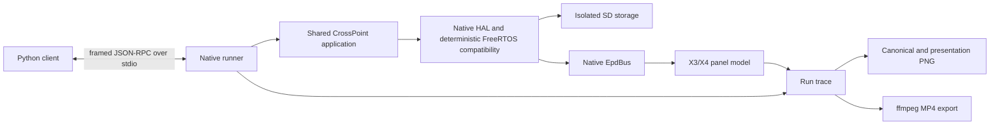

# X3/X4 Emulator Plan

## Decision

Build a deterministic, host-native emulator that compiles the same CrossPoint application, activity, EPUB, rendering,
settings, and persistence sources as the firmware. PlatformIO selects native implementations at the existing hardware
and system boundaries; emulator conditionals do not spread through application code.

The emulator models the X3 and X4 as explicit device profiles. Python owns a headless emulator subprocess and controls
it through a versioned framed JSON-RPC protocol over standard input/output. Tests mutate the device only through physical
controls, reset/power, simulated time, and isolated SD contents. Narrow read-only automation signals provide reliable
activity, render, panel, timing, scheduler, and storage waits.

This is a calibrated behavioral emulator, not an ESP32 firmware-binary or electrochemical simulator. Determinism and
source parity take priority over instruction-level fidelity. Nominal device-speed profiles are deliberately deferred
until they can be measured repeatedly on physical X3 and X4 devices.

### Persistence compatibility decision

Cache paths use a project-owned fixed 32-bit hash that reproduces the ESP32-C3 toolchain's existing libstdc++
`std::hash<std::string>` result. Native builds must not use the host's 64-bit `std::hash`: that would create different
`epub_<N>` directories, miss device caches, and strand `progress.bin` in host-only paths. Persisted formats continue to be
read and written by shared firmware code; native storage does not translate them.

### Capture and presentation decision

Canonical panel and framebuffer PNGs retain controller-native geometry and are compared as decoded grayscale pixels,
not compressed PNG bytes. `capture.screenshot` and MP4 presentation rotate those pixels 90 degrees clockwise into the
natural handheld orientation. System zlib keeps stored artifacts compact, while pixel-plane comparisons avoid false
golden failures when the zlib implementation changes.

### Why this direction

- CrossPoint already routes display, input, storage, clock, power, system, and tilt behavior through `lib/hal/`.
- The real X3 and X4 panel drivers already contain the difficult refresh promotion, retained controller-RAM, grayscale,
  resync, and power-state behavior. Native builds should reuse those state machines through a native `EpdBus`.
- Host-native execution makes scheduling, time, fixtures, captures, and failure artifacts controllable and reproducible.
- The same application sources prevent a separately implemented emulator UI from drifting away from firmware behavior.

### Rejected foundations

- **ESP32-C3 QEMU:** CrossPoint PR
  [#500](https://github.com/crosspoint-reader/crosspoint-reader/pull/500) proved framebuffer, SD, input, and web control,
  but suffered random watchdog failures and unsupported GPIO/peripheral paths. QEMU instruction counting is deterministic,
  not cycle-accurate, so it cannot supply trustworthy device-speed fidelity by itself.
- **Wokwi:** useful prior art for Python lifecycle/peripheral automation, but it introduces a hosted token dependency and
  still requires custom SSD1677/UC8253 behavior.
- **Physical ESP32-C3 execution:** useful later as a calibration and conformance backend, but unsuitable as the required
  engine for local and CI tests.
- **Separate SDL/web application:** the PlusPoint proof of concept shows that native display/input is viable, but a parallel
  application shell would duplicate and drift from CrossPoint.

## Goals

- Run the real CrossPoint reading flow on Linux/WSL without Xteink hardware.
- Select X3 or X4 explicitly for every run.
- Reproduce device geometry, capabilities, display-controller state, e-ink refresh phases, retained panel state, and
  deterministic approximate ghosting.
- Mount an isolated SD fixture, exercise real persistence/cache code, and preserve hardware byte compatibility.
- Inject physical press, hold, release, power, and reset inputs.
- Provide Playwright-like synchronous Python control with explicit waits and useful failure artifacts.
- Capture both composed framebuffer pixels and simulated visible panel pixels.
- Record a replayable structured run trace and derive deterministic presentation PNGs and MP4 from it.
- Run unpaced for tests or wall-clock-paced for interactive observation without changing simulated results.

## Deferred work

- Hardware-calibrated nominal X3/X4 CPU, rendering, SD, and panel timing profiles.
- Performance assertions that claim device-speed accuracy.
- Exact ESP32 heap capacity, fragmentation, and OOM behavior; milestone 1 only reports emulator-owned allocations.
- Wi-Fi, OPDS, OTA, Calibre, USB-state, battery, RTC-device quirks, and X3 tilt behavior beyond deterministic stubs.
- Pixel-exact physical ghosting, voltage-level or electrochemical panel simulation, and temperature effects.
- Device surrounds, physical-button overlays, and timing overlays for presentation output.
- Native Windows/macOS packaging, a live interactive GUI, and remote attachment to an existing emulator process.
- Seeded scheduling, storage-fault, and slow-device stress profiles.

## Architecture



### Build and source boundaries

- Add a PlatformIO native environment dedicated to the emulator.
- Compile the normal `src/` application and internal libraries in that environment.
- Select alternate implementation files for HAL, Arduino/ESP compatibility, FreeRTOS compatibility, and `EpdBus` at
  build time. Do not add runtime virtual dispatch to the firmware build.
- Keep the headless runner, protocol, models, and native compatibility code under an `emulator/` tree.
- Keep the `uv`-managed Python package under `emulator/python/`, with type annotations and strict Pyright checking.
- Changes needed to make the real panel drivers work with a native `EpdBus` belong in `freeink-sdk`; update this repository's
  submodule pin only after those changes are independently verified.

Proposed shape:

```text
emulator/
  native/                 native runner, protocol, scheduler, HAL/platform implementations
  profiles/               versioned development and later calibrated profiles
  python/
    pyproject.toml
    src/crosspoint_emulator/
test/emulator/
  fixtures/               immutable SD fixture inputs
  goldens/x3/             canonical panel PNGs
  goldens/x4/
```

### Deterministic time and scheduling

- One simulated clock is authoritative for firmware-visible time, device costs, traces, and video.
- Tests run unpaced; interactive execution may pace simulated time at 1x or another multiplier.
- MP4 duration comes from simulated time, never host execution time.
- Native FreeRTOS compatibility serializes execution as a deterministic single-core scheduler. Host threads may hold task
  stacks, but only one emulated task runs at a time.
- Scheduling points are FreeRTOS boundaries: task notification, semaphore, queue, delay, and yield.
- Runnable ties resolve by priority and creation order.
- Each automation wait has both a simulated-time timeout and a larger wall-time deadlock watchdog.
- RTC start, random seed, filesystem ordering, locale, and timezone are explicit run inputs recorded in the manifest.

Milestone 1 uses clearly named, uncalibrated development timing. It must not expose performance assertions or describe
those timings as X3/X4 speed measurements.

### Device profiles

Every launch requires `x3` or `x4`; native mode bypasses I2C hardware fingerprint probing.

| Property | X3 | X4 |
| --- | --- | --- |
| Panel geometry | 792x528 | 800x480 |
| Controller | UC8253 | SSD1677 |
| Panel driver | Real `Uc8253X3Driver` | Real `Ssd1677Driver` |
| Profile selection | Explicit run input | Explicit run input |

Later profile versions add calibrated CPU/rendering, SD, and panel timings without changing the protocol or application
boundary.

### Panel behavior

The native `EpdBus` consumes the real panel drivers' command/data traffic and maintains:

- controller B/W and secondary RAM planes;
- loaded waveform/LUT identity and refresh mode;
- power, deep-sleep, BUSY, initial-sync, and resync state;
- visible grayscale panel state distinct from controller RAM and the application framebuffer;
- refresh history used by deterministic retention/ghosting approximations;
- time-resolved transition phases for panel recordings.

The panel model reproduces observable full/half/fast/grayscale behavior and intermediate flashes. It does not claim
pixel-exact physical artifacts. Panel-model and profile versions are included in every trace and capture.

A new run records an explicit initial panel state: white by default, or black/a supplied PNG. `reset()` and sleep/wake
clear volatile execution state while preserving SD and visible panel contents. A fresh run creates new isolated storage
and initial panel state.

### Storage

- An SD fixture is an immutable host directory used as the initial card contents.
- Each run receives a private writable copy; the fixture is never modified.
- The native `HalStorage` implementation enforces deterministic enumeration and the application-visible FAT32 path/name
  constraints needed by CrossPoint.
- All storage operations emit trace events. Timing/fault costs are injected by later profiles.
- Do not emulate SD blocks or require a FAT image in milestone 1.
- Persisted settings, progress, metadata, and section cache files remain byte-compatible with hardware. Fix host-ABI
  dependencies in shared serialization rather than translating formats in native storage.

### Inputs and observability

The protocol injects and records physical controls:

- four bottom-edge buttons;
- volume up and volume down;
- power;
- reset.

Logical helpers such as `press_action("confirm")` may resolve the current mapping, but must inject the resulting physical
button. This keeps remapping, orientation, debounce, holds, and combinations on the real application path.

Supported screens gain a small shared `ActivityId` enum with stable protocol names such as `boot`, `home`, `file_browser`,
and `reader.epub`. Do not expose C++ class names or free-form activity labels as automation contracts.

Initial explicit waits:

- `wait_for_activity(id)`;
- `wait_for_render(after=generation)`;
- `wait_for_panel_idle()`;
- `wait_for_storage_idle()`;
- `advance(duration)`.

There is no generic `wait_for_idle()` because background work makes global idleness ambiguous.

### Protocol and Python API

- Python owns the subprocess lifecycle.
- Use a versioned framed JSON-RPC protocol over stdin/stdout; emulator logs go only to stderr.
- Begin every connection with a compatibility handshake containing protocol, trace, device-profile, and panel-model
  versions plus the run artifact directory.
- Responses and asynchronous events share the framed channel and carry monotonically increasing sequence numbers.
- Large images/traces/video are written under the artifact directory and referenced by path, not base64-encoded in the
  control channel.
- Keep the protocol transport-neutral so a future interactive viewer can use a WebSocket adapter without changing
  semantics.

The initial Python surface is synchronous and library-first:

```python
with Emulator.launch("x3", sd="test/emulator/fixtures/library") as device:
    device.wait_for_activity("home")
    device.press_action("confirm")
    device.wait_for_panel_idle()
    device.capture_panel("home.png")
```

Provide optional thin pytest fixtures, but no YAML scenario DSL, mandatory pytest plugin, or async API in milestone 1.

### Trace, captures, and video

The run trace is the canonical recording and contains:

```text
run/
  manifest.json            versions, profile, seed, RTC, fixture identity, environment
  events.jsonl             simulated-time controls, signals, spans, storage, scheduler, panel events
  frames/                  deduplicated canonical panel PNGs referenced by events
  captures/                explicitly requested framebuffer/panel captures
  presentation/            derived framed/scaled captures and MP4
  stderr.log
```

- Canonical framebuffer captures contain composed 1-bit pixels before refresh behavior.
- Canonical panel captures contain native-geometry visible grayscale state and are visual-test truth.
- `capture.screenshot` writes a human-review presentation PNG rotated into the natural handheld orientation; canonical
  framebuffer and panel captures stay in controller-native orientation.
- Other presentation captures may scale, add an X3/X4 surround, show button presses, or overlay timing.
- MP4 is generated from the trace with the system `ffmpeg` CLI. Record encoding arguments and FFmpeg version.
- Trace and PNG features work without FFmpeg; video export reports a clear missing-dependency error.
- Commit compact canonical X3/X4 PNG goldens. Do not commit MP4 goldens; validate generated video duration and frame count.
- Keep timing assertions separate from image assertions.

## Implementation phases

Each phase should remain independently buildable and reviewable. Refactors and behavior changes should be separate commits.

### 1. Native execution spine

- Add the PlatformIO native environment and headless `main()` runner around the existing `setup()`/`loop()` lifecycle.
- Add the protocol framing, version handshake, stderr logging separation, explicit X3/X4 selection, and artifact root.
- Add the minimum Arduino/ESP compatibility needed to compile shared application code.
- Add deterministic clock and single-core FreeRTOS task/notification/semaphore/delay behavior.
- Provide native system, clock, power, tilt, and GPIO boundaries with explicit unsupported operations.

Exit criteria:

- Both profiles launch and complete the protocol handshake on Ubuntu/WSL.
- Two identical no-op runs produce the same normalized event sequence.
- A stalled task trips the wall-time watchdog with scheduler diagnostics.

### 2. Isolated storage and boot

- Implement directory-backed `HalStorage` and `HalFile` with isolated run state, deterministic enumeration, and tracing.
- Load real settings/state/recents from an SD fixture.
- Audit persistence code for host-ABI-dependent serialization and preserve documented on-device formats.
- Reach a stable Home activity using shared application sources.

Exit criteria:

- Fixture contents remain unchanged after a run.
- Reset preserves run storage; a fresh run starts from the fixture.
- Emulator-created persisted files round-trip through existing firmware readers and format checks.

### 3. Native display bus and panel model

- Make the FreeInk X3/X4 panel drivers host-buildable without changing their firmware behavior.
- Add the build-selected native `EpdBus` and controller RAM/state interpretation.
- Model initial panel state, power/BUSY intervals, refresh promotion, full/half/fast paths, grayscale, resync, retention, and
  deterministic approximate ghosting.
- Emit canonical framebuffer and panel captures at native X3/X4 geometry.

Exit criteria:

- Real X3/X4 driver call sequences produce distinct, expected panel traces.
- Reset and sleep/wake retain visible panel state.
- Repeated runs produce byte-identical canonical captures.

### 4. Input and automation signals

- Inject physical press/hold/release combinations through the native GPIO path with real debounce semantics.
- Add stable `ActivityId` values only for the supported vertical slice.
- Emit render generations, activity changes, panel BUSY/idle, storage activity, timing spans, and scheduler diagnostics.
- Implement explicit wait commands and dual simulated/wall timeout behavior.

Exit criteria:

- Remapped buttons and holds exercise `MappedInputManager`, not an emulator shortcut.
- Python can deterministically wait from boot to Home and through a panel refresh.

### 5. Python client and EPUB vertical slice

- Create the `uv`-managed, strictly typed synchronous Python package and context-manager lifecycle.
- Add optional pytest fixtures and automatic failure-artifact retention.
- Add a minimal SD fixture containing an existing small EPUB test asset.
- Drive Home/library/open/page-turn entirely through device controls on X3 and X4.
- Add canonical panel PNG goldens and semantic trace assertions.

Exit criteria:

- One Python scenario completes `launch -> Home -> library -> EPUB -> page turn` on both profiles.
- Two runs with identical inputs produce identical normalized traces and panel goldens.
- Ubuntu CI builds the native target and runs the scenario headlessly.

### 6. Recording and presentation

- Persist the canonical trace, deduplicated panel transition frames, and manifest.
- Add deterministic trace replay and fixed-FPS sampling.
- Rotate replay output into natural handheld orientation; richer optional presentation overlays are deferred.
- Export MP4 through FFmpeg and validate duration/frame count without committing video binaries.

Exit criteria:

- The EPUB page-turn scenario exports an MP4 for both device profiles.
- Re-encoding the same trace uses the same simulated duration and visual frame sequence.
- Changing presentation FPS requires no emulator rerun.

### 7. Later calibration and fidelity

- Capture repeated phase-level traces from physical X3 and X4 devices using the same scenarios and trace vocabulary.
- Commit versioned nominal timing profiles for CPU/rendering, SD operations, and panel transitions.
- Enable performance assertions only after profile variance and tolerances are documented.
- Add a deterministic constrained allocator, seeded schedule/storage stress, secondary hardware, networking, and additional
  host platforms as separate work.

## Milestone 1 acceptance

Milestone 1 comprises phases 1-6 and is complete when:

- A clean Linux/WSL checkout builds firmware normally and builds the emulator through PlatformIO Native.
- The same CrossPoint application sources run on explicit X3 and X4 profiles.
- Python drives the complete EPUB page-turn scenario using physical controls and explicit waits.
- SD state is isolated and persisted formats remain hardware-compatible.
- Canonical framebuffer and panel captures are reproducible and profile-correct.
- Reset/sleep semantics retain panel and SD state.
- A structured run trace explains device controls, scheduler decisions, storage activity, renders, and panel transitions.
- Deterministic MP4 can be derived from the trace.
- Ubuntu CI verifies the headless scenario and compact PNG goldens.
- Documentation clearly labels development timing as uncalibrated; no device-speed accuracy claim is made.

## Main risks

- **Host compilation surface:** Arduino, ESP, FreeRTOS, and third-party dependencies reach beyond the existing HAL. Keep
  compatibility APIs narrow and move each newly discovered hardware capability behind an existing or justified boundary.
- **Scheduler deadlock:** infinite task loops require correct notification/semaphore behavior. Preserve scheduler state in
  traces and enforce an independent wall-time watchdog from the first runnable slice.
- **Panel-model drift:** a high-level reimplementation would diverge quickly. Reuse the real panel drivers and make their
  native bus event sequences testable.
- **Submodule coordination:** `EpdBus` work crosses into `freeink-sdk`. Land and verify SDK changes independently before
  updating the CrossPoint submodule pin.
- **Persistence ABI drift:** Linux is 64-bit while ESP32-C3 is 32-bit. Treat fixed-width documented serialization as the
  contract and reject host-only cache translations.
- **False performance confidence:** deterministic development timing is useful for ordering and video, not accuracy. Keep
  calibrated profile names and performance assertions unavailable until physical measurements exist.

## Verification during implementation

At the end of every phase:

- build the normal firmware target to catch emulator leakage;
- build the PlatformIO native target with warnings treated as errors where practical;
- run deterministic scenarios twice and compare normalized traces;
- inspect `git status` for generated artifacts or fixture mutation;
- keep emulator-specific behavior out of activities and content/rendering code;
- retain generated traces, captures, and video only as requested or on failure.
